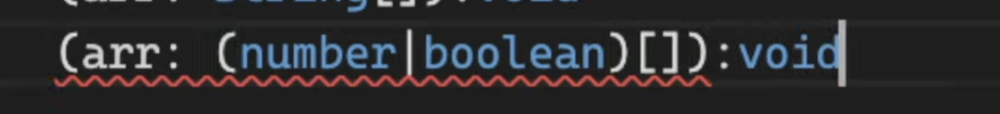

# 타입스크립트로 블록체인 만들기

- Typescript를 쓰는 이유

  1. 타입 안정성
  2. 코드 실행 전에 검증(런타임 에러 방지)

- [타입스크립트로 블록체인 만들기](#----------------)
- [OVERVIEW OF TYPESCRIPT](#overview-of-typescript)
  - [- 2.0 How Typescript Works](#--20-how-typescript-works)
  - [- 2.1 Implicit Types vs Explicit Types](#--21-implicit-types-vs-explicit-types)
  - [- 2.2 Rypes of TS part One](#--22-rypes-of-ts-part-one)
  - [- 2.3 Types of TS part Two](#--23-types-of-ts-part-two)
  - [- 2.4 Types of TS part Three](#--24-types-of-ts-part-three)
  - [- 3.0 Call Signatures](#--30-call-signatures)

<br>

# OVERVIEW OF TYPESCRIPT

### - 2.0 How Typescript Works

타입스크립트로 작성하면 자바스크립트로 변환(컴파일링)된다.

브라우저는 자바스크립트만 이해할 수 있고, Node.js는 타입스크립트와 자바스크립트 모두 이해할 수 있다.

타입스크립트 코드에 에러가 있으면 그 코드는 자바스크립트로 컴파일 되지 않는다.

<br>

### - 2.1 Implicit Types vs Explicit Types

타입스크립트에서는 데이터와 변수의 타입을 명시적(explicit)으로 정의할 수도 있고, 자바스크립트처럼 변수만 쓰고 넘어가도 된다.(implicit)

변수만 쓰고 넘어가면 타입스크립트가 타입을 추론해준다.

웬만하면 explicit으로 써주기.

<br>

### - 2.2 Rypes of TS part One

- Array
  

- Object
  
  물음표를 쓰면 꼭 가질 필요 없음.

  
  위의 코드에서 age를 가져오면 undifined일 수 도 있다고 경고해줌.

  
  만약 플레이어를 이렇게 다 따로 만든다고 하면 너무 비효율적이다.

  그럴 때는
  
  (첫 문자는 대문자로.)

  > 이건 object에서만 쓰는게 아니다.
  > 

- Function의 return type 정하기

  > 

  arrow function에서 return type 정하기

  > 

<br>

### - 2.3 Types of TS part Two


readonly 사용하면 한번 저장한 데이터를 바꿀 수 없다.

정해진 개수의 item을 가지는 배열을 생성하기.


readonly하면 배열도 못 바꿈.


- any : (Typescritp의 보호로부터 벗어날 수 있다.) => 사용하지 않는 것을 추천한다고 함.
  가끔 써야 할 때가 있다. 그때 말고는 쓰지 마라.

<br>

### - 2.4 Types of TS part Three

Typescripta에서 중요한 포인트는 Type Checker와 소통하는 것이다.

- unknown : 어떤 타입인지 모를때.(예: API에서 정보 받아오기)
  
  if로 check해야 사용 가능.

- void : return 값이 없는 함수를 의미
  
  따로 지정해줄 필요는 없다. (:void 써도 상관은 없음.)

- never : 함수가 절대 return하지 않을 때 발생.
  
  void랑은 뭐가 다름? => 밑에 예시 보고 확인.
  
  이건 또 된다고 함.

  never는 타입이 두가지일 수도 있는 상황에서 발생할 수 있다. (never도 type이라는 점을 기억해라)
  
  마지막 else문 안에 있는 name의 타입은 never가 된다. (절대 실행되면 안되는 코드... ) 직접 never을 쓰진 않지만 마우스를 올렸을 때 뜨면 무슨 의미인지 알아야 한다.

<br>

### - 3.0 Call Signatures

다형성(polymorphism), 오버로딩(overloading), 제네릭(generics)에 대해서 배움.


a와 b의 type을 number로 지정해줫더니 function add의 return type 또한 자동으로 number로 type 지정된 것을 확인할 수 있다. 그러니까 우리는 항상 모든 타입을 지정해주는 것은 아니다.(참고)

근데 이번에는 `const add = (a:number, b:number)`에서 `:number`타입을 작성하지 않는 법을 공부해봄.(call signiture)

- call signiture : 함수 위에 마우스를 올렸을 때 보게 되는 걸 의미
  (함수를 어떻게 호출하는지, return 타입이 뭔지)

  ```Typescript
  // call signature
  type Add = (a:number, b:number) => number;

  const add:Add = (a, b) => a + b;
  ```

  Add의 타입을 타입스크립트가 알기때문에 a와 b의 타입을 매번 지정해줄 필요가 없다.
  

<br>

### - 3.1 Overloading

- overloading : 외부 라이브러리를 사용하면서 많이 보게 될 것. 복잡하지만 어떻게 생긴 건지 알아야 한다.

  오버로딩은 함수가 서로 다른 call signature를 여러개 가지고 있을 때 발생.
  
  call signature를 두개 가지고 있다.
  따라서 마지막 줄에 오류가 남.(b가 string이 되면 안되니까)

```typescript
type Config ={
  path: string,
  state: object
}

 // 함수의 parameter을 쓸 때는 콤마(',') 없나 봄...
type Push = {
  (path:string):void
  (config):config:void
}

const push:Push =(config) => {
  if(typeof config === "string") console.log(config)
  else{
    console.log(config.path, config.state)
  }
}
```


if에서 string을 한번 걸렀기 때문에 else안에서는 반드시 Config 타입 객체라는 것을 타입스크립트가 알고 있음.

파라미터 개수가 다르게 가지는 경우


오류가 생김. c 파라미터는 옵션 같은 것. (a, b를 부를 수도 있지만 a, b, c를 부를 수도 있기 때문)


물음표를 이용해서 c가 number일 수도 있다고 알려줘야 함.
그리고 if에서 c 가 있으면 a+b+c를 return, 없으면 a+b를 retrun


코드 오류 없음

<br>

### - 3.2 Polymorphism

- ploymorphism : 다형성. 여러가지 형태를 가지고 있음.


배열을 받아서 forEach로 각 요소들을 뿌려주는 코드.

array 안의 type이 boolean도 될 수 있게 하려면,

이렇게 써주면

잘 작동함.

string은 안됨.


그렇다고 다시 또 추가해주면 되냐? => 되긴 하지만 이렇게 하지 않는다.

- concrete type : 이때까지 배운 type들. number, string, boolean, void, unknown, ...
- generic : 타입의 placeholder 같은 거.
  
  이런게 가능하도록 하고싶다.
  
  모든 가능성을 따져서 이렇게 만들면 너무 지저분하다.

  이처럼 들어올 타입을 모를 때 generic을 사용.

  먼저, generic을 사용하겠다고 선언해야 함.
  
  `< 이름 >`를 앞에다 붙여주면 해당 call signature가 제네릭을 받는다는 것을 알려주는 것.

  
  이런 걸 알아서 해준다.

<br>

### - 3.3 Generics Recap
