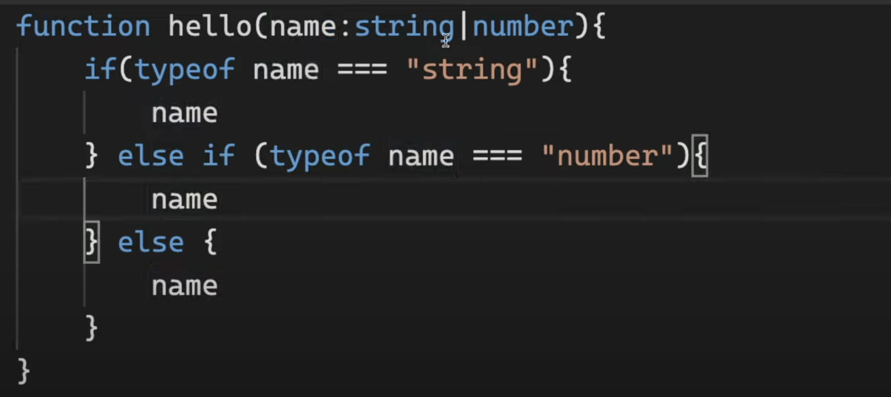

# 타입스크립트로 블록체인 만들기

- Typescript를 쓰는 이유
  1. 타입 안정성
  2. 코드 실행 전에 검증(런타임 에러 방지)

 

# OVERVIEW OF TYPESCRIPT

### - 2.0 How Typescript Works

타입스크립트로 작성하면 자바스크립트로 변환(컴파일링)된다.

브라우저는 자바스크립트만 이해할 수 있고, Node.js는 타입스크립트와 자바스크립트 모두 이해할 수 있다.

타입스크립트 코드에 에러가 있으면 그 코드는 자바스크립트로 컴파일 되지 않는다.

 

### - 2.1 Implicit Types vs Explicit Types

타입스크립트에서는 데이터와 변수의 타입을 명시적(explicit)으로 정의할 수도 있고, 자바스크립트처럼 변수만 쓰고 넘어가도 된다.(implicit)

변수만 쓰고 넘어가면 타입스크립트가 타입을 추론해준다.

웬만하면 explicit으로 써주기.

 

### - 2.2 Rypes of TS part One

- Array
  

- Object
  
  물음표를 쓰면 꼭 가질 필요 없음.

  
  위의 코드에서 age를 가져오면 undifined일 수 도 있다고 경고해줌.

  
  만약 플레이어를 이렇게 다 따로 만든다고 하면 너무 비효율적이다.

  그럴 때는
  
  (첫 문자는 대문자로.)

  > 이건 object에서만 쓰는게 아니다.
  > 

- Function의 return type 정하기

  > 

  arrow function에서 return type 정하기

  > 

 

### - 2.3 Types of TS part Two

readonly 사용하면 한번 저장한 데이터를 바꿀 수 없다.

정해진 개수의 item을 가지는 배열을 생성하기.

readonly하면 배열도 못 바꿈.

- any : (Typescritp의 보호로부터 벗어날 수 있다.) => 사용하지 않는 것을 추천한다고 함.
  가끔 써야 할 때가 있다. 그때 말고는 쓰지 마라.

 

### - 2.4 Types of TS part Three

Typescripta에서 중요한 포인트는 Type Checker와 소통하는 것이다.

- unknown : 어떤 타입인지 모를때.(예: API에서 정보 받아오기)
  
  if로 check해야 사용 가능.

- void : return 값이 없는 함수를 의미
  
  따로 지정해줄 필요는 없다. (:void 써도 상관은 없음.)

- never : 함수가 절대 return하지 않을 때 발생.
  
  void랑은 뭐가 다름? => 밑에 예시 보고 확인.
  
  이건 또 된다고 함.

  never는 타입이 두가지일 수도 있는 상황에서 발생할 수 있다. (never도 type이라는 점을 기억해라)
  
  마지막 else문 안에 있는 name의 타입은 never가 된다. (절대 실행되면 안되는 코드... ) 직접 never을 쓰진 않지만 마우스를 올렸을 때 뜨면 무슨 의미인지 알아야 한다.

 

### - 3.0 Call Signatures

다형성(polymorphism), 오버로딩(overloading), 제네릭(generics)에 대해서 배움.

a와 b의 type을 number로 지정해줫더니 function add의 return type 또한 자동으로 number로 type 지정된 것을 확인할 수 있다. 그러니까 우리는 항상 모든 타입을 지정해주는 것은 아니다.(참고)
